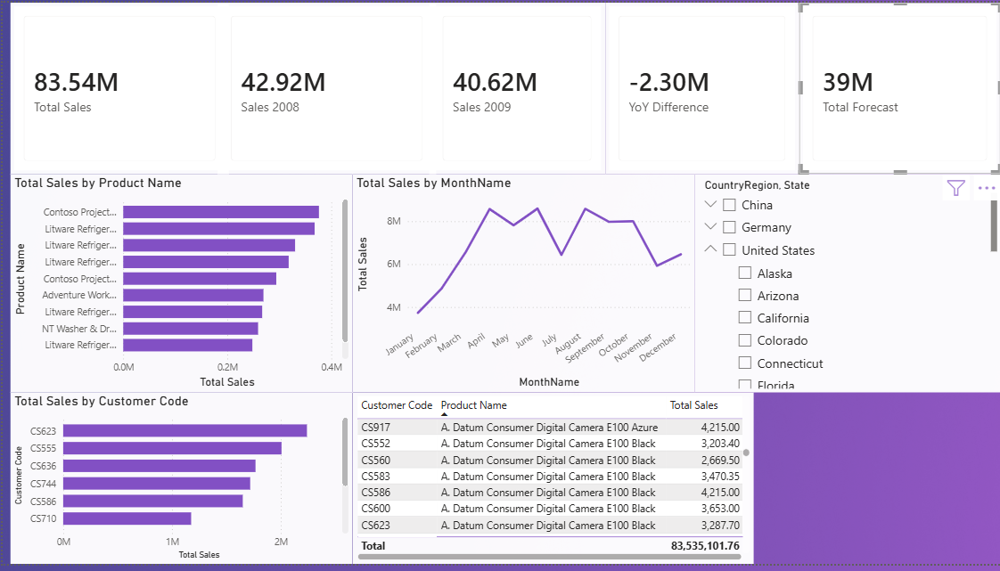

# Sales Analytics Pipeline

## Project Overview

This project implements an end-to-end sales analytics solution consisting of:

* Data exploration and profiling
* ETL pipeline development using Python and Pandas
* Power BI dashboard development
* Sales performance and forecast analysis

The objective is to transform raw JSON sales and forecast data into a structured analytical model that supports business reporting and decision-making.

---

## Project Architecture

Raw JSON Data

↓

Data Exploration

↓

ETL Pipeline

↓

Power BI Dashboard

↓

Business Insights

---

## Dataset Description

### Sales Dataset

Transaction-level sales data containing:

* Product information
* Customer information
* Geographic information
* Order dates
* Quantity sold
* Net price

Dataset size:

* 298,246 sales records

### Forecast Dataset

Forecasted sales values aggregated by:

* Country
* Brand
* Year

Dataset size:

* 33 forecast records

---

## Data Exploration

The exploratory analysis focused on:

### Data Structure Validation

* Dataset dimensions
* Column types
* Record counts

### Data Quality Assessment

* Missing value detection
* Duplicate analysis
* Data consistency checks

### Business Understanding

* Sales transaction granularity
* Forecast granularity
* Product distribution
* Customer distribution
* Geographic distribution

### Key Findings

* Sales data spans years 2008 and 2009
* Customer demographic attributes contain missing values
* SalesAmount can be derived from Quantity × Net Price
* Sales data is transaction-level
* Forecast data is aggregated at Country-Brand-Year level
* Forecast and Sales require separate fact tables due to differing granularity

---

## ETL Pipeline

The ETL process was implemented in Python using Pandas.

### Extract

Raw JSON files are loaded into Pandas DataFrames.

### Transform

Transformations include:

* Date conversion
* Missing value handling
* SalesAmount calculation
* Dimension table creation
* Fact table creation

### Load

The transformed data is exported as CSV files for Power BI consumption.

---

## Data Model

The project uses a Star Schema design.

### Fact Tables

#### FactSales

Contains transactional sales data.

Columns:

* OrderDate
* ProductKey
* CustomerKey
* CountryRegion
* State
* City
* Quantity
* Net Price
* SalesAmount

#### FactForecast

Contains forecasted sales values.

Columns:

* CountryRegion
* Brand
* Forecast
* Year

---

### Dimension Tables

#### DimProduct

* ProductKey
* Product Name
* Brand
* Category
* Subcategory
* Color

#### DimCustomer

* CustomerKey
* Customer Code
* Name
* Education
* Occupation

#### DimDate

* Date
* Year
* Month
* MonthName
* Quarter

---

## Power BI Dashboard

The dashboard provides the following analytical views:

### KPI Metrics

* Total Sales
* Sales 2008
* Sales 2009
* Year-over-Year Difference
* Total Forecast

### Product Analysis

* Top 10 Products by Sales

### Sales Trend Analysis

* Monthly Sales Trend

### Customer Analysis

* Top Customers by Sales
* Customer Product Purchases

### Geographic Analysis

Interactive filters for:

* Country
* State

---

## DAX Measures

### Total Sales

Calculates total revenue.

SalesAmount = Quantity × Net Price

### Sales 2008

Total sales filtered for year 2008.

### Sales 2009

Total sales filtered for year 2009.

### YoY Difference

Difference between 2009 and 2008 sales.

### Total Forecast

Aggregated forecast value.

---

## Technologies Used

### Python

* Pandas
* NumPy

### Business Intelligence

* Microsoft Power BI Desktop
---

## Future Improvements

Potential enhancements include:

* Automated ETL scheduling
* Database integration (PostgreSQL / SQL Server)
* Incremental data loading
* Advanced forecasting models
* Additional Power BI dashboards
* Deployment to Power BI Service

### Dashboard

